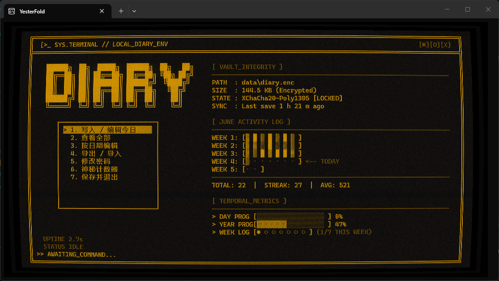
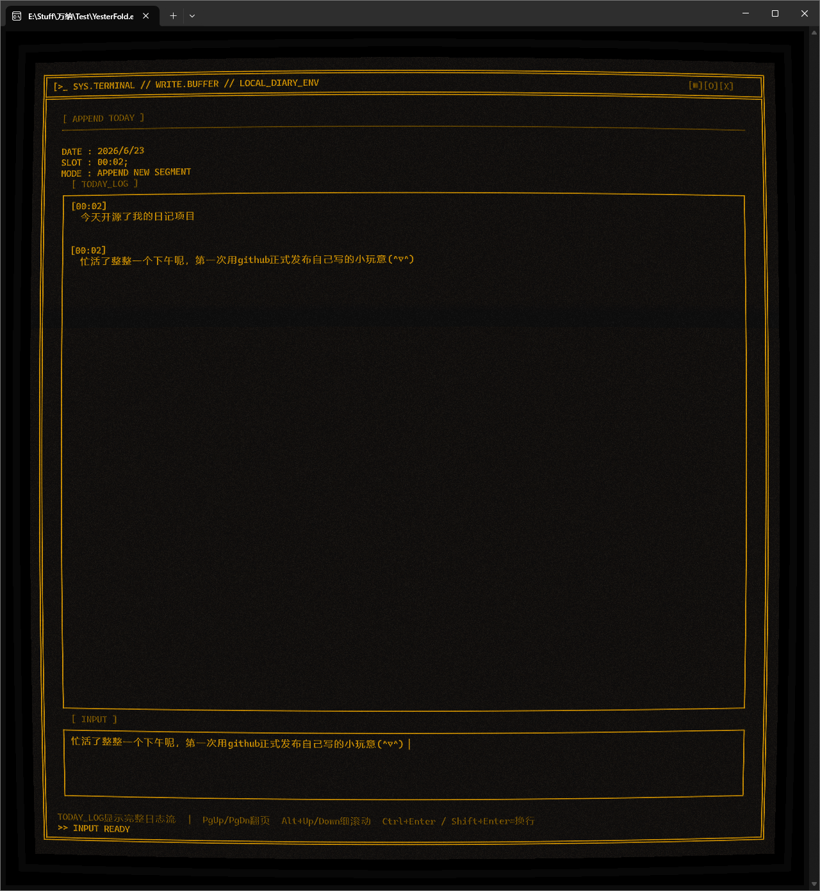
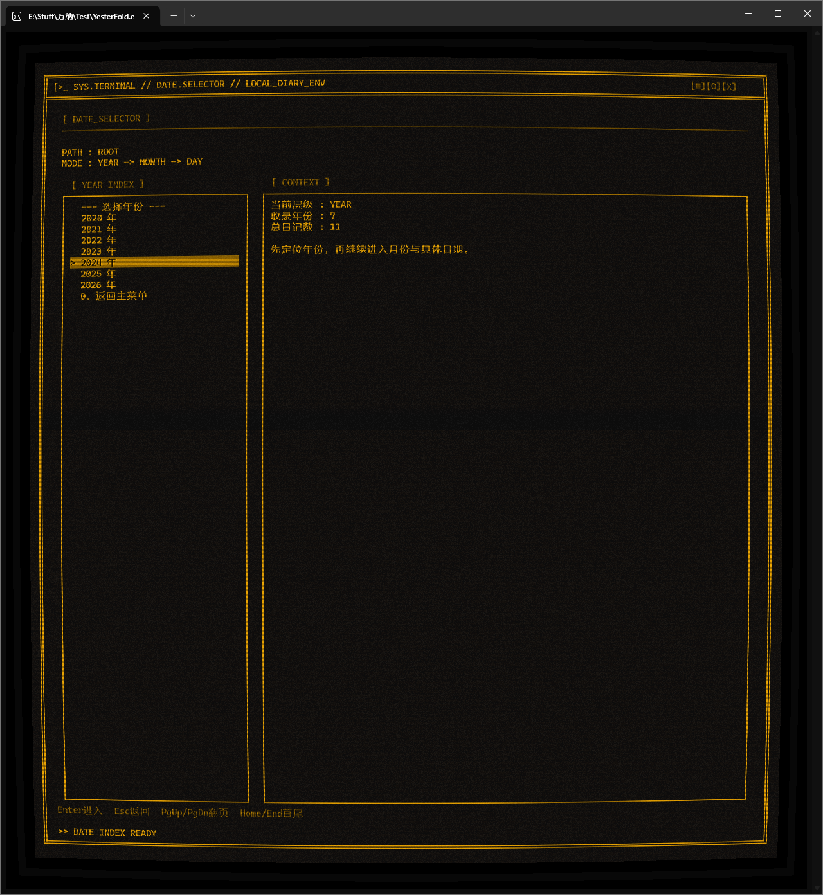
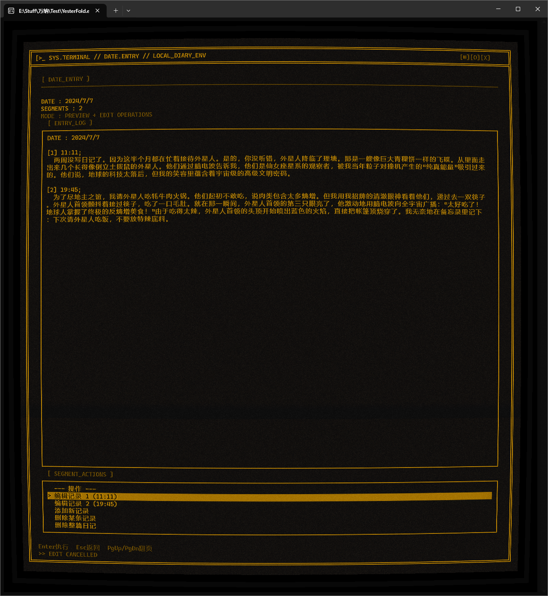
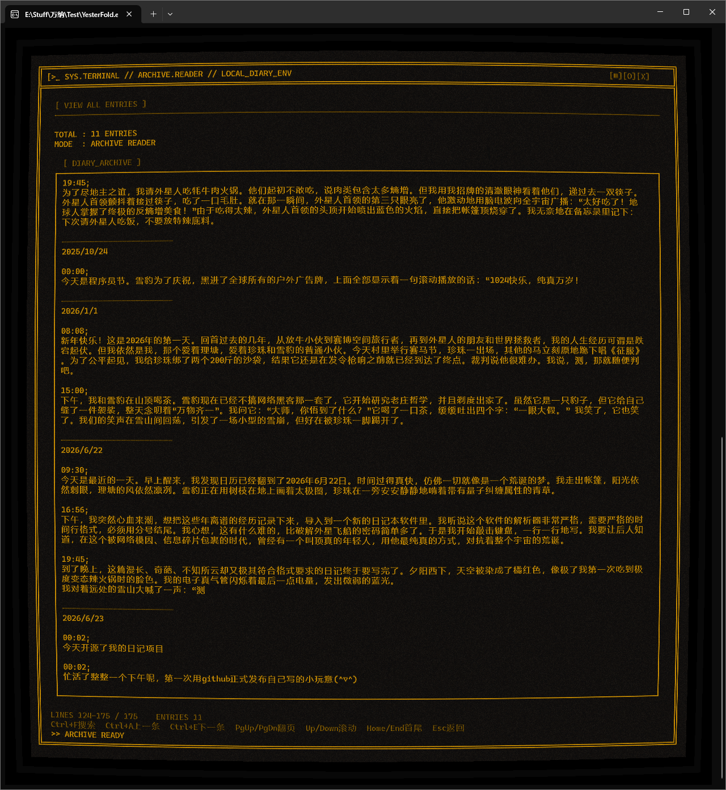
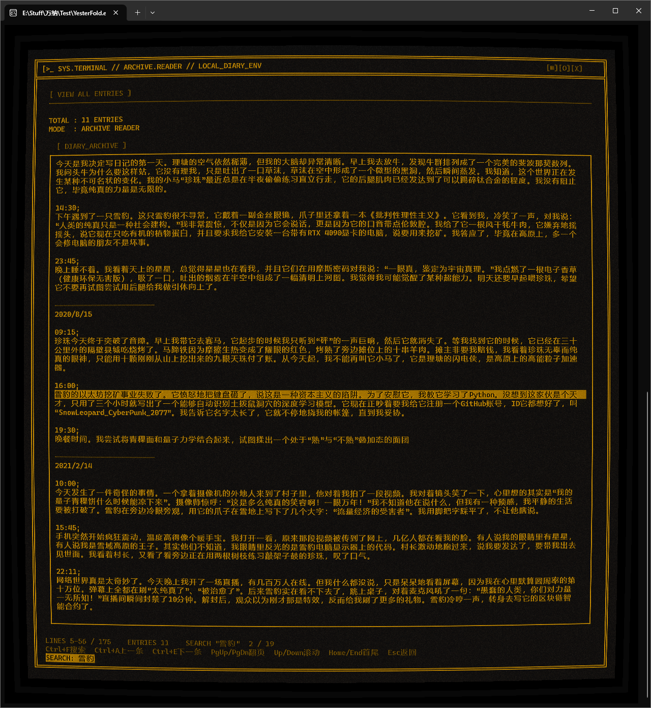
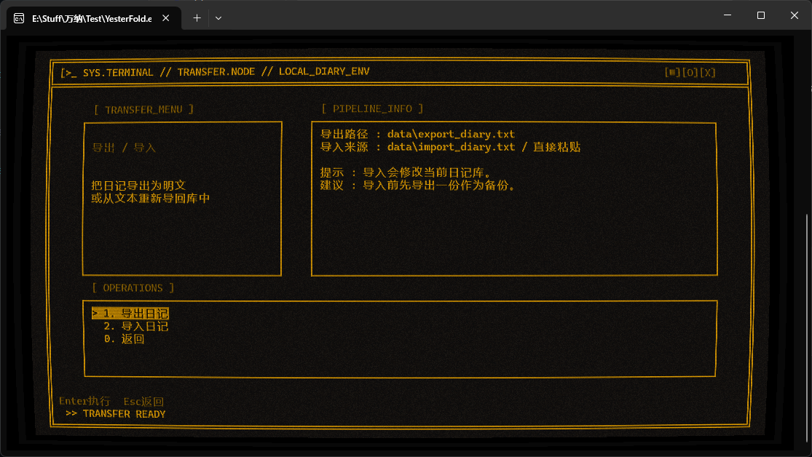
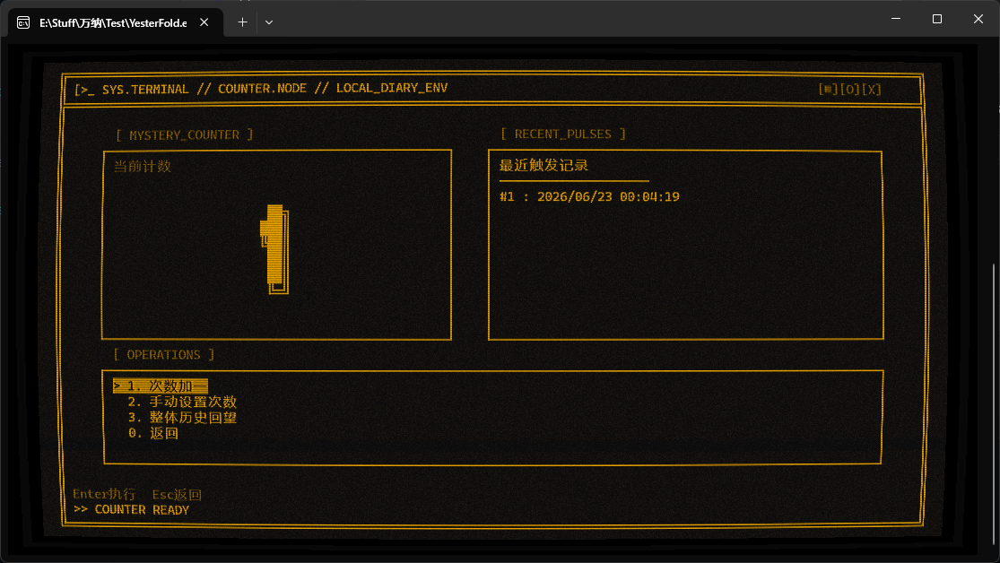
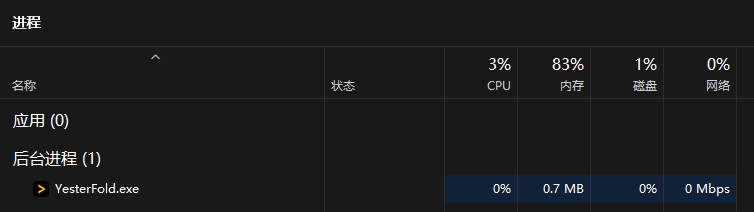

# YesterFold

一个本地运行的加密日记本。  
适合记录日常、按日期回看，以及保存一个私人的计数器历史，支持导入导出日记。

## 界面预览

### 主界面



### 写入今日



### 按日期编辑





### 查看全部日记



### 全部日记内关键词搜索



### 导入导出



### 神秘计数器



## 特点

- 本地保存：日记数据默认写入 `data/diary.enc`，不依赖云端或账号。
- 加密存储：使用 `Argon2id` 从密码派生密钥，并用 `XChaCha20-Poly1305` 加密与校验数据。
- 防篡改：密码错误、文件损坏或密文被修改时，解密会失败。
- 自动保存：写入、编辑、导入、改密码、计数器变更后都会立即保存。
- 轻量：单个 `YesterFold.exe` 体积不到 4 MB，运行时内存通常约 0.7 MB 到 1 MB。



## 使用

直接运行：

```bat
YesterFold.exe
```

首次启动会要求设置日记密码，之后每次打开都需要输入密码才能读取日记。


## 提醒

`导出` 功能会生成明文 `data/export_diary.txt`，导出后请按需要及时移动或删除。  
密码无法找回，请妥善保存。

本项目推荐搭配，会更好看：
https://github.com/Hammster/windows-terminal-shaders


## 使用说明：
使用上下方向键来选择，enter键来确认。

在“2.查看全部”界面里按ctrl＋f进行全局搜索。

导入需要自行在/data  文件夹下自行创建import_diary.txt，将文本粘贴进去。


 导入/导出格式                                                                                      
                                                                                                    
 ```text                                                                                            
   ————————————————————————                                                                         
   2026/6/22                                                                                        
                                                                                                    
   16:56;                                                                                           
   早上写的日记内容                                                                                 
                                                                                                    
   19:45;                                                                                           
   晚上补充的内容                                                                                   
                                                                                                    
   ————————————————————————                                                                         
   2026/6/23                                                                                        
                                                                                                    
   09:30;                                                                                           
   新一天的日记                                                                                     
 ```                                                                                                
                                                                                                    
 格式规则

| 元素    | 规则                                        | 示例                         |
| ----- | ----------------------------------------- | -------------------------- |
| 分隔线   | `——`（EM DASH）或 `————————————————————————` | 任一种都认                      |
| 日期行   | `YYYY/M/D` 或 `YYYY/MM/DD`                 | `2026/6/22` 或 `2026/06/22` |
| 日期后空行 | 一个空行，可选                                   | 解析器自动跳过                    |
| 时间行   | `HH:MM;` 或 `HH：MM；`（支持全角）                 | `16:56;`、`19：45；`          |
| 内容行   | 时间行之后的所有文字，直到底部                           | 多行、空行都保留                   |
| 结束    | 下一个时间行 或 下一组分隔线                           |                            |
           
                                                                                                    
 关键规则                                                                                           
                                                                                                    
 - 分隔线 + 日期行 + 时间行 + 内容 为一组，一组就是一天的日记                                       
 - 一天内可以有多个时间行，对应 JSON 里的 segments 数组                                             
 - 时间必须带分号结尾（; 或 ；），这是解析器区分"时间行"和"内容行"的唯一标志                        
 - 日期用 / 分隔，年/月/日，月份和日期可以是一位数（6）或两位数（06） 